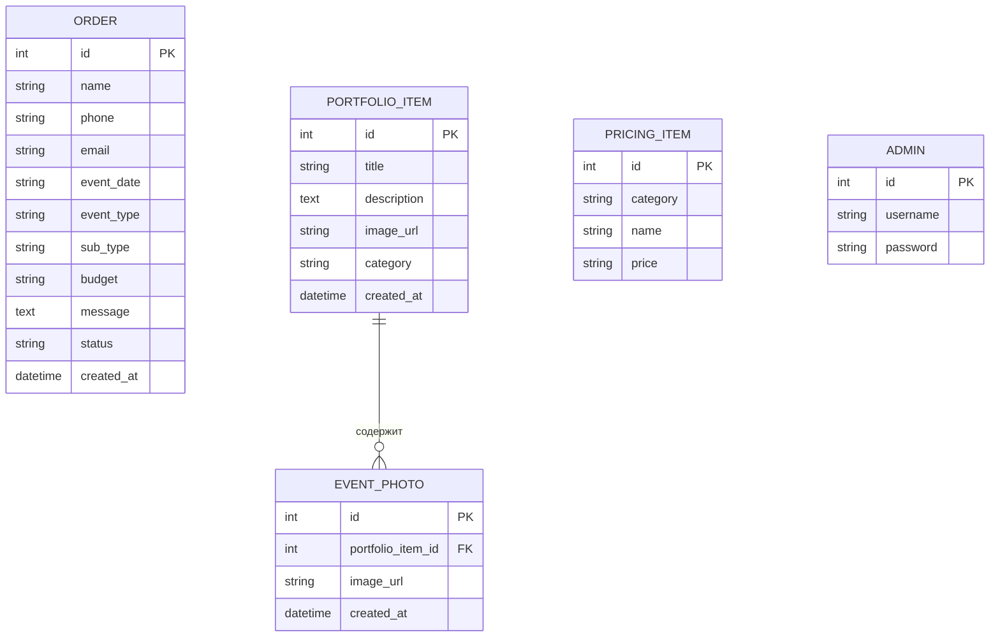

# Схема базы данных (ER Диаграмма)

Ниже представлена структура таблиц базы данных проекта и связи между ними.

## Описание таблиц

### 1. `ORDER` (Заявки)
Хранит данные, поступающие из формы заказа.
- **event_type**: Тип мероприятия (Частное/Корпоративное).
- **status**: Текущий статус обработки (new, completed, cancelled).

### 2. `PORTFOLIO_ITEM` (Работы в портфолио)
Основные записи о проектах, которые отображаются на главной странице и в категориях.
- Имеет связь "один-ко-многим" с таблицей фотографий.

### 3. `EVENT_PHOTO` (Дополнительные фото)
Хранит ссылки на дополнительные фотографии для галереи конкретного проекта.
- **portfolio_item_id**: Внешний ключ, связывающий фото с проектом.

### 4. `PRICING_ITEM` (Услуги и цены)
Хранит список услуг, которые отображаются в блоке прайс-листа.
- **category**: Группировка (private/corporate).

### 5. `ADMIN` (Администраторы)
Данные для входа в панель управления.
